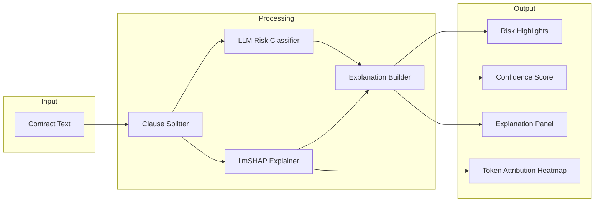

# Contract Risk Explainer

## Project Summary

Contract Risk Explainer is an explainable AI tool that analyzes contracts and highlights potentially risky clauses while showing why they are considered risky. Instead of acting as a black box, the system provides transparent reasoning by identifying influential words, assigning risk scores, and generating human-readable explanations. This helps users understand legal risks faster and build trust in AI-assisted contract analysis.

---

## Project Description

Contracts often contain complex language, hidden obligations, and ambiguous clauses that are difficult to interpret without legal expertise. While large language models can summarize contracts, they typically do not explain how they reached their conclusions. This lack of transparency makes it difficult for users to trust AI-generated legal insights.

Contract Risk Explainer addresses this problem by combining LLM-based contract analysis with explainability techniques. The system splits a contract into clauses, evaluates each clause for potential risks, and highlights problematic sections. It then uses attribution methods to identify which parts of the text influenced the risk decision. Users can click on a clause to view explanations, risk scores, and highlighted keywords that contributed to the assessment.

The result is an interactive and transparent contract analysis tool that helps users understand not only what is risky, but also why it is risky.

---

## Project Goals
- Primary Goals
- Build a working proof-of-concept for explainable contract risk analysis
- Identify and highlight risky clauses in legal text
- Provide transparent explanations for each risk detection
- Show which words influenced the AI decision
- Deliver an interactive and easy-to-understand UI
- Secondary Goals
- Assign risk scores to clauses (low / medium / high)
- Provide overall contract risk summary
- Allow users to click clauses for detailed explanations
- Visualize token importance using attribution methods
- Keep the system fast and usable in real-world scenarios
- Real-World Impact
- Help non-lawyers understand contracts quickly
- Increase trust in AI-assisted legal tools
- Improve transparency in automated decision systems
- Reduce risk in business agreements and negotiations
- Demonstrate explainable AI for high-stakes decision making

---

## One-Sentence Pitch

Contract Risk Explainer is an explainable AI system that highlights risky contract clauses and shows exactly why they are risky, turning legal black boxes into transparent, understandable decisions.

---

## Project Structure

```
contract_risk_explainer/
├── backend/        FastAPI service + analysis engine (clause splitter, classifier, llmSHAP explainer)
│   ├── app/        HTTP layer — routes under /contracts (upload, analyze)
│   └── engine/     Core analysis pipeline and llmSHAP attribution
├── web/            Next.js 16 + React 19 + Tailwind UI (active frontend)
├── frontend/       Legacy Angular UI (kept for reference)
├── contracts/      Sample contracts used for local testing
├── design/         Static design artifacts and prototypes
└── Makefile        Dev tasks (install, dev, backend, web, stop, clean)
```

---

## Getting Started

### Requirements
- Python 3.11+ with `fastapi`, `uvicorn`, `python-multipart`, `python-dotenv`, `pypdf`, `openai`
- Node.js 20+ and `npm`

### Install dependencies
```bash
make install
```
This installs backend Python packages and runs `npm install` in `web/`. Override the Python interpreter with `make install PYTHON=python3.12` if needed.

### Run backend + web together
```bash
make dev
```
- Backend (FastAPI): http://localhost:8000
- Web (Next.js):     http://localhost:3000

### Run each side individually
```bash
make backend   # FastAPI on :8000
make web       # Next.js on :3000
make stop      # free both ports
make clean     # remove .next, .turbo, __pycache__
```

### API endpoints
- `POST /contracts/upload`  — extract text from a PDF and run the service-level analyzer
- `POST /contracts/analyze` — extract text from a PDF and run the full engine pipeline

Both accept a `multipart/form-data` request with a `file` field.

---

## Flowchart

